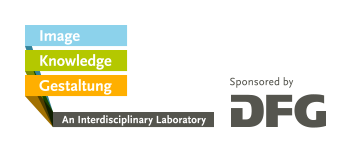

# Partners

## Conference organized by

[{: width="248px"}](https://www.interdisciplinary-laboratory.hu-berlin.de)

## In collaboration with

[{: width="248px" margin-right="10px"}](http://www.amdnet.de)

[{: width="248px"}](http://www.netzwerk-mode-textil.de)

## Concept and Organization

- Sabine de Günther M.A., Research Associate, »_Image Knowledge Gestaltung_. An Interdisciplinary Laboratory«  
- Prof. Dr. Philipp Zitzlsperger, Associate Member, »_Image Knowledge Gestaltung_. An Interdisciplinary Laboratory«

## Contact

Cluster of Excellence »_Image Knowledge Gestaltung_. An Interdisciplinary Laboratory«  
Humboldt-Universität zu Berlin  
Unter den Linden 6  
10099 Berlin  
Germany  

[bwg.zeichen-und-symbole@hu-berlin.de](mailto:bwg.zeichen-und-symbole@hu-berlin.de)  
[www.interdisciplinary-laboratory.hu-berlin.de](http://www.interdisciplinary-laboratory.hu-berlin.de)
